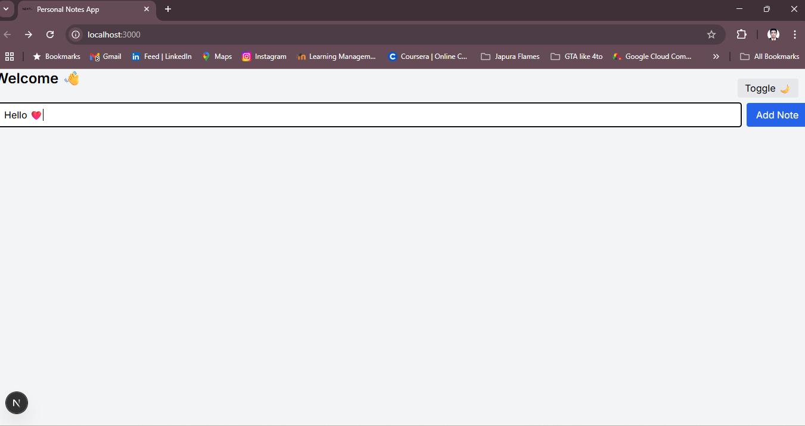
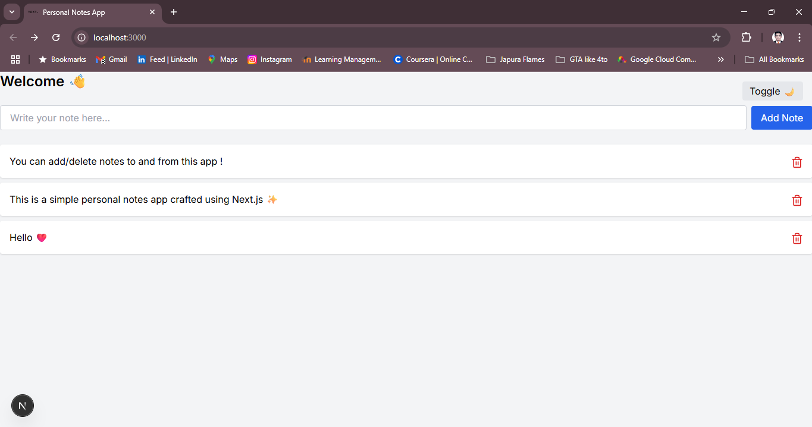

# Personal Notes App

A simple, elegant, and responsive notes application built with **Next.js 15.4 (App Router)**, **React**, and **Tailwind CSS - 13.4.14**.  
This project features dark mode support, localStorage persistence, and clean UI with icon-based controls.

## Features

- **Add and delete notes** dynamically  
- **Dark and light mode toggle** with theme persistence  
- Notes are **saved locally in browser's localStorage** to persist between sessions  
- Responsive UI designed with **Tailwind CSS**    
- Modern icons integrated via **Lucide React**  
- Clean, modular code structure following Next.js best practices

## Technologies Used

- [Next.js 15.4](https://nextjs.org/) (App Router)  
- [React 19.1](https://reactjs.org/)  
- [Tailwind CSS](https://tailwindcss.com/)  
- [Lucide React](https://lucide.dev/) for icons  
- Browser **localStorage** API for data persistence

## Getting Started

### Prerequisites

- Node.js (v18 or newer recommended)  
- npm or yarn  

### Installation

1. Clone the repository  
   ```bash
   git clone https://github.com/KalharaBatangala/personal-notes-webapp.git
   cd personal-notes-webapp

2. Install dependencies

    ```bash
    npm install
    # or
    yarn install

3. Run the development server

    ```bash
    npm run dev
    #or 
    yarn dev

4. Open http://localhost:3000 in your browser


## Demo


